# IEEE-ENETCOM-SB-EMBS-CHALLENGE

Welcome to EMBS CHALLENGE

In our solution, the embedded system, which can be portable, provides continuous monitoring of
health parameters at home. It&#39;s designed for patients under physician supervision. This system
operates on low power consumption by activating and deactivating our system.

    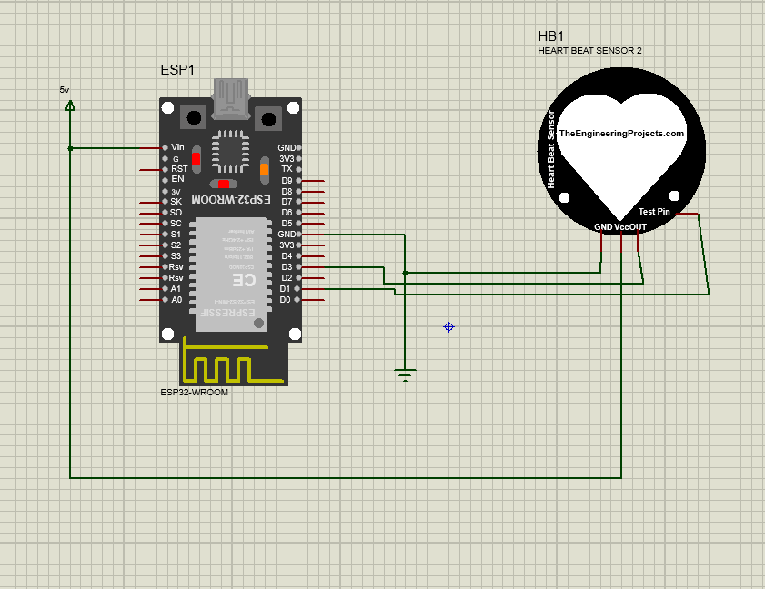
  

Data security is our top priority, and we&#39;ve integrated Firebase&#39;s power to ensure real-time data
protection and transmission.

    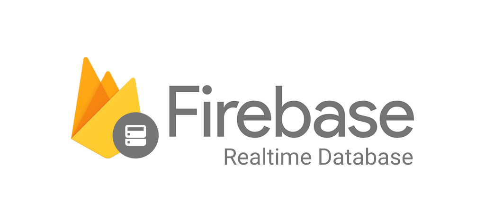
  

  Regarding our mobile application dedicated to patients, developed using the Flutter framework:
  The initial interface offers several options: at the top, three flags allow the user to select the
  application&#39;s language (the Tunisian flag for Arabic, the French flag for French, and the English flag for
  English). Then, the &quot;record&quot; button moves to the next interface.
    

      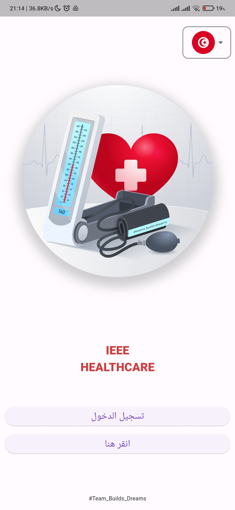
         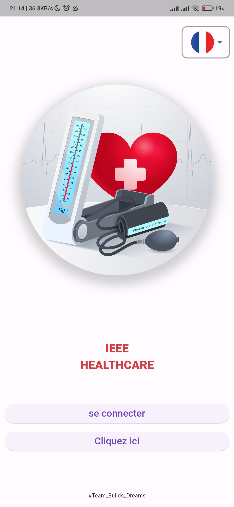
        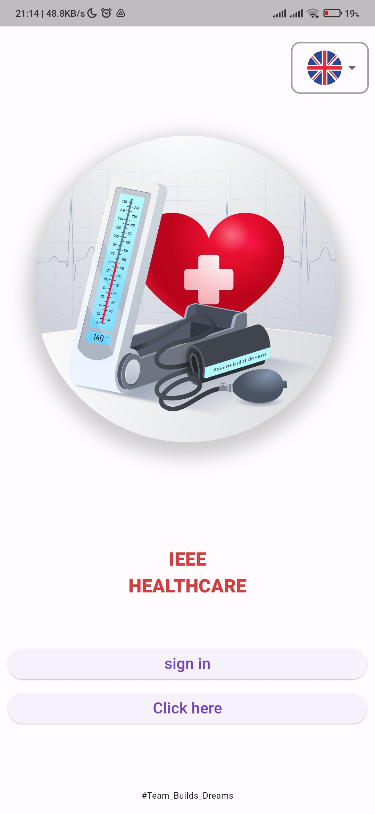
    

  The second interface enables the user to enter their credentials and click a button to log in.
  

    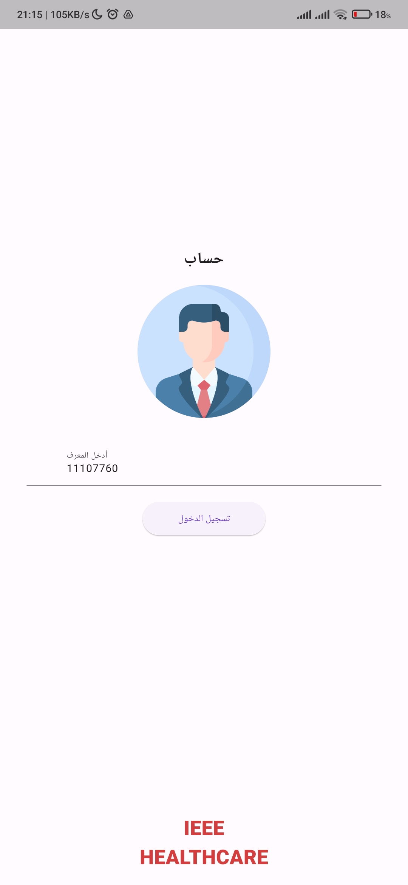
  

  Upon clicking &quot;Log In,&quot; a third interface appears, presenting various options. The user can choose to
  monitor specific measures or review the history of previous measurements.
  

    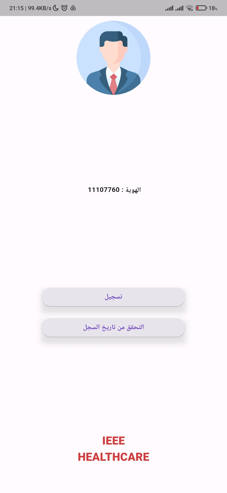
  

  By selecting &quot;Historic&quot; :
  

    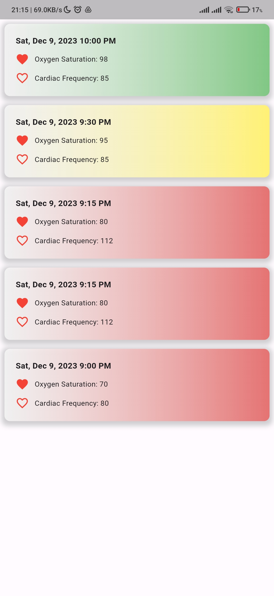
  

  By selecting &quot;Record,&quot; a new interface allows the user to choose the measurements to record by
  clicking one of the two available buttons (heart rate or oxygen level).
    

      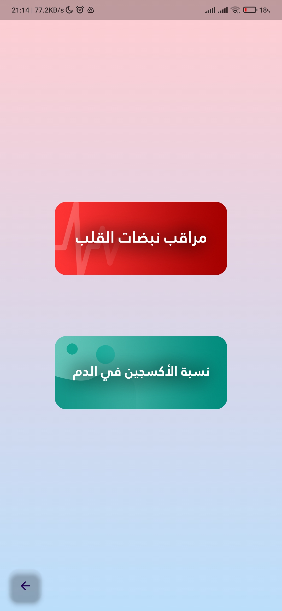
          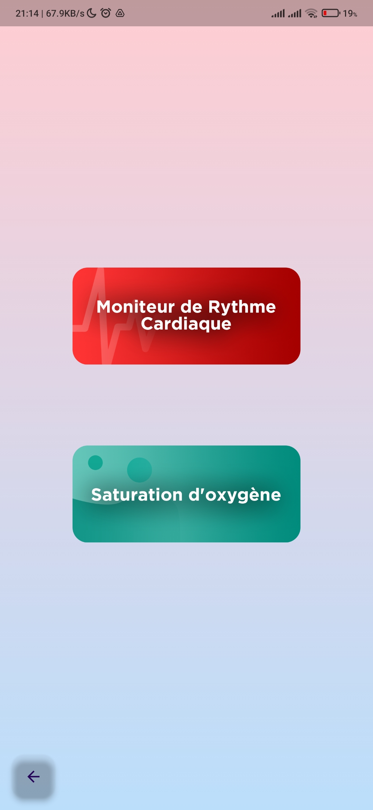
        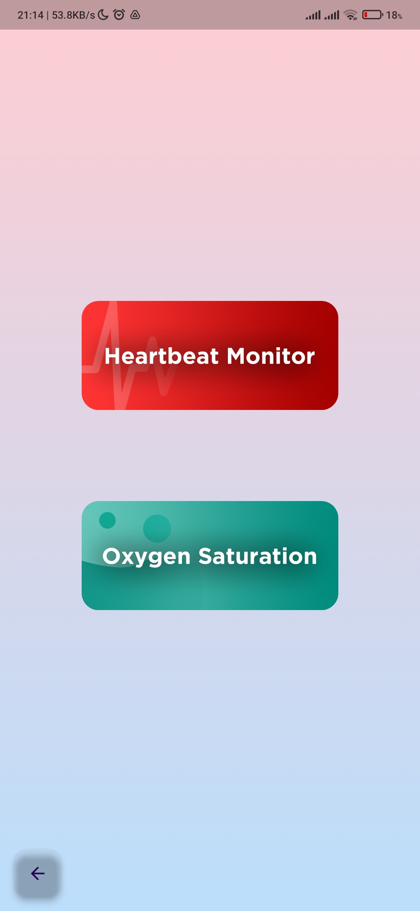
    

  For monitoring the heart rate, an interface opens displaying a color that changes according to the
  patient&#39;s condition (green for optimal, yellow for high-normal, red for elevated). The value measured
  by the IoT system is shown in real-time. Then, the status of this value is indicated. 
 
    

      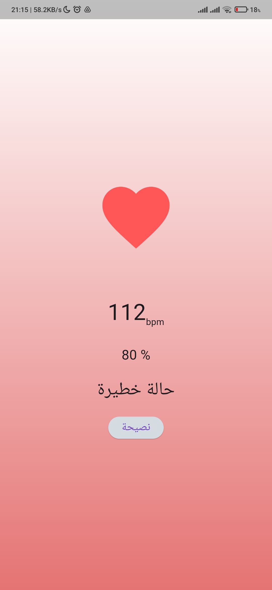
        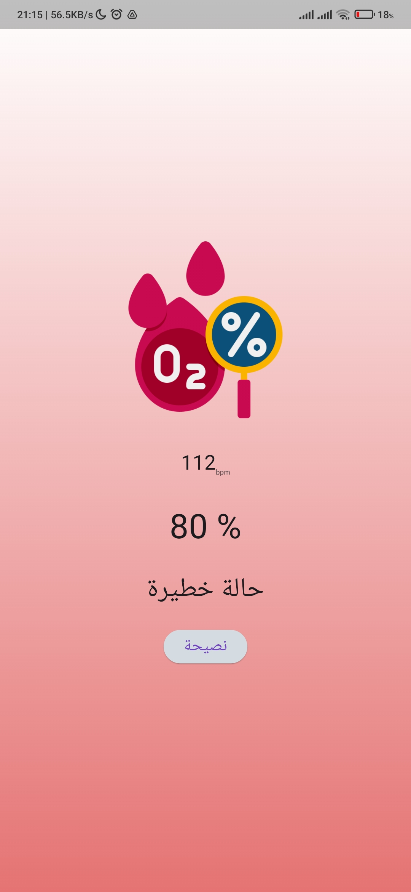
    

   
  Finally, a button
  displays tailored advice based on the patient&#39;s condition.
  

    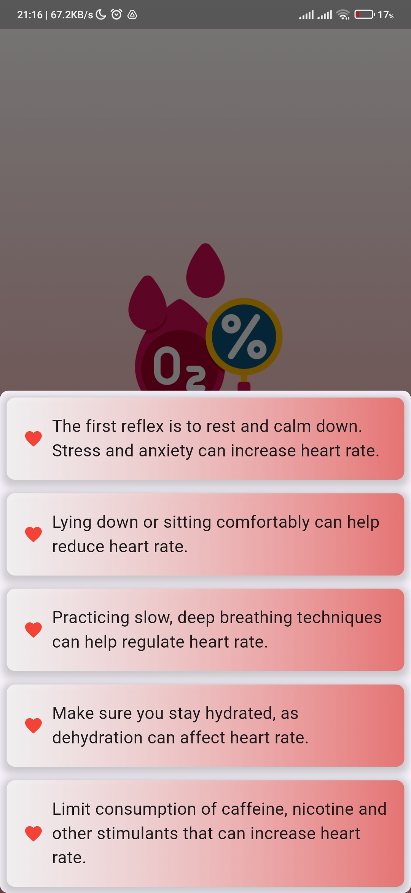
  

  
  To ensure our system operates dynamically, the implementation of a dynamic component is
necessary. This is why we opted for Spring Boot and SQL.

    
  

  Our solution goes beyond the individual experience; it extends its impact through a web application
  developed using the Angular framework.
  It&#39;s designed for doctors, who access it through the first interface: a login page with two fields to fill
  in email address and password. To access the second interface, the doctor must complete both
  required fields. Otherwise, an alert prompts them to fill in the missing fields.
  

    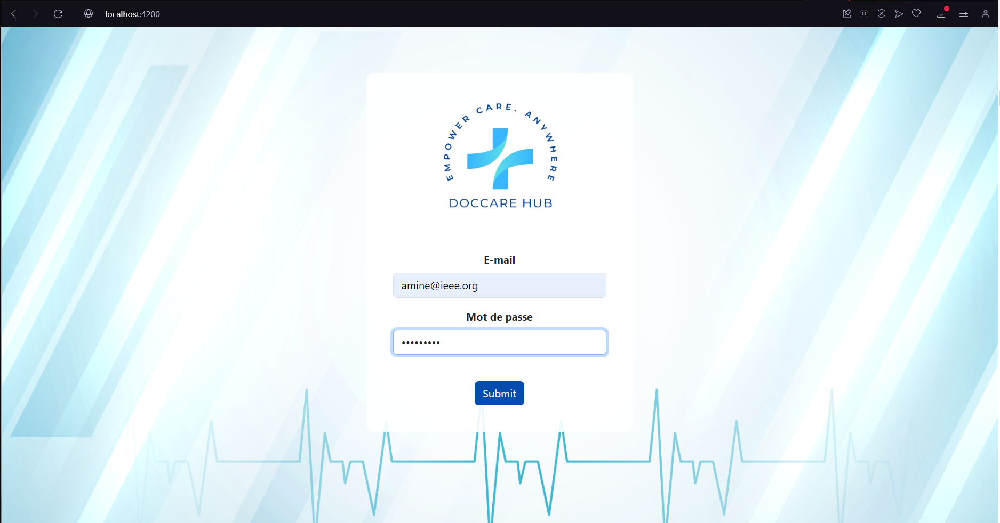
  

  
  The second interface features a top navigation bar, including a button to add a new patient, a search
  bar to find patients, and a button to analyze data. Next, a table lists information such as the patient&#39;s
  name, date and time, gender, age, heart rate, oxygen level, patient status (indicated in green for
  stable, yellow for unstable, and red for critical), and possible actions (such as modifying or deleting
  patient data).
  

    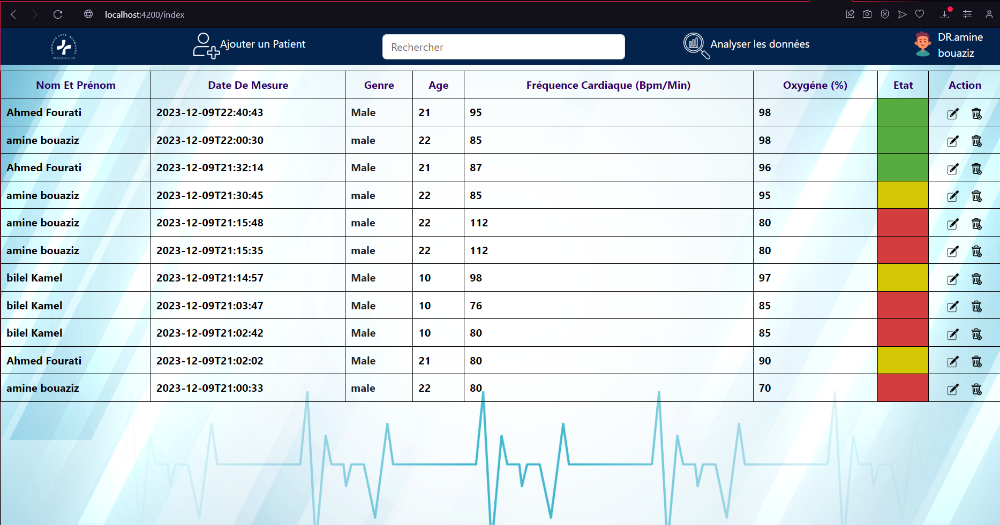
  

  by clicking on the modify patient data:
  

    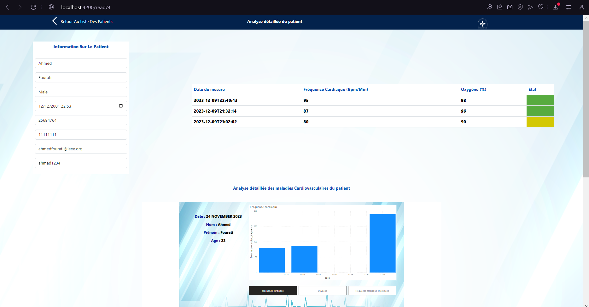
  

  Clicking the button to add a patient opens a new interface displaying a form to fill out: name,
  surname, gender, date of birth, phone number, national identification number, email address,
  password, and diseases to monitor. After completing this information, a &quot;Submit&quot; button is available.
  

    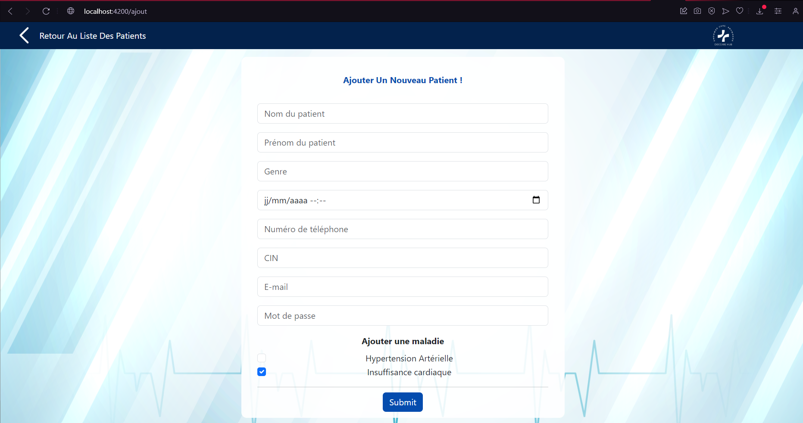
  

 
  Pressing the button to analyze data displays Power BI-generated graphs, analyzing each patient&#39;s
  data in real-time.
  

    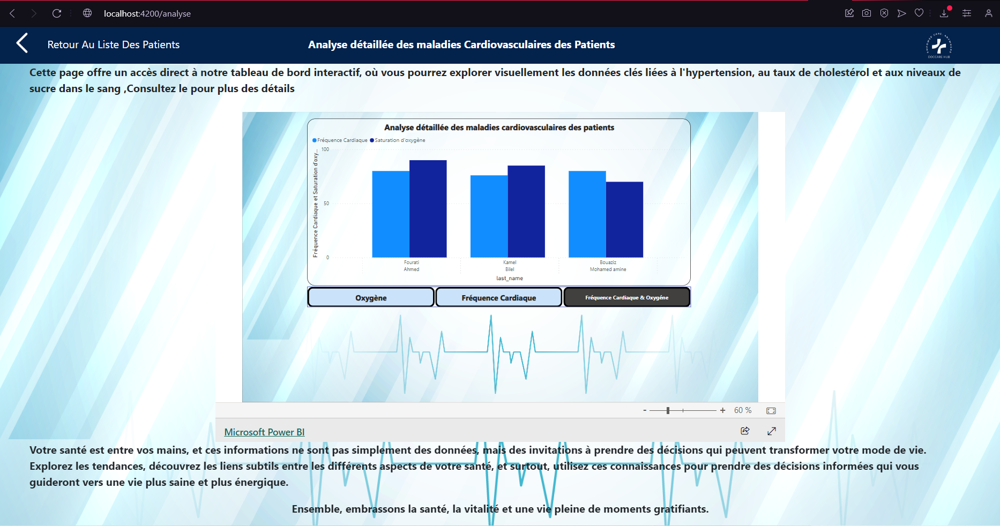
  

  ## Public Solution :
  Regarding the public device installed in pharmacies and medical offices, the MAX30102 sensor plays
a crucial role by detecting both heart rate and oxygen levels. It&#39;s connected to Firebase to ensure
data security and real-time transfer of the sensor-detected data.
An interface will display the values detected by the sensor as well as the patient&#39;s status. The initial
interface offers several options: at the top, three flags allow the user to select the application&#39;s
language (the Tunisian flag for Arabic, the French flag for French, and the English flag for English).
By selecting &quot;click here,&quot; a new interface enables the user to choose the measurements to record by
clicking one of the two available buttons (heart rate or oxygen level).
For monitoring the heart rate, an interface opens displaying a color that changes according to the
patient&#39;s condition (green for optimal, yellow for high-normal, red for critical). The value measured
by the sensor is shown in real-time. Finally, a button displays tailored advice based on the patient&#39;s
condition.
